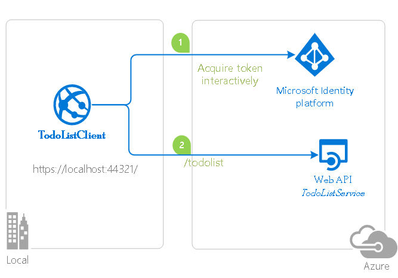

# Enable your Java Spring Boot web app to sign in users with Azure Active Directory and call a protected Web api

[](https://identitydivision.visualstudio.com/IDDP/_build/latest?definitionId=XXX)

* [Overview](#overview)
* [Scenario](#scenario)
* [Prerequisites](#prerequisites)
* [Setup the sample](#setup-the-sample)
* [Explore the sample](#explore-the-sample)
* [Troubleshooting](#troubleshooting)
* [About the code](#about-the-code)
* [How to deploy this sample to Azure](#how-to-deploy-this-sample-to-azure)
* [Next Steps](#next-steps)
* [Contributing](#contributing)
* [Learn More](#learn-more)

## Overview

This sample demonstrates a Java Spring Web application calling a Java Spring Web API that is secured using Azure AD.

## Scenario

This sample demonstrates a Java Spring Web application calling a Java Spring Web API that is secured using Azure AD.

1. The client Java Spring Web application uses the [MSAL.java](https://aka.ms/identityplatform) to sign-in a user and obtain a JWT [ID Token](https://aka.ms/id-tokens) and an [Access Token](https://aka.ms/access-tokens) from **Azure AD**.
1. The **access token** is used as a *bearer* token to authorize the user to call the Java Spring Web API protected by **Azure AD**.



## Prerequisites

* [JDK Version 15](https://jdk.java.net/15/). This sample has been developed on a system with Java 15 but may be compatible with other versions.
* [Maven 3](https://maven.apache.org/download.cgi)
* [Java Extension Pack for Visual Studio Code](https://marketplace.visualstudio.com/items?itemName=vscjava.vscode-java-pack) is recommended for running this sample in VSCode.
* An **Azure AD** tenant. For more information, see: [How to get an Azure AD tenant](https://docs.microsoft.com/azure/active-directory/develop/test-setup-environment#get-a-test-tenant)
* A user account in your **Azure AD** tenant.
>This sample will not work with a **personal Microsoft account**. If you're signed in to the [Azure portal](https://portal.azure.com) with a personal Microsoft account and have not created a user account in your directory before, you will need to create one before proceeding.

## Setup the sample

### Step 1: Clone or download this repository

From your shell or command line:

```console
git clone https://github.com/Azure-Samples/ms-identity-java-spring-tutorial.git
```

or download and extract the repository *.zip* file.

> :warning: To avoid path length limitations on Windows, we recommend cloning into a directory near the root of your drive.

### Register the sample application(s) with your Azure Active Directory tenant

There are two projects in this sample. Each needs to be separately registered in your Azure AD tenant. To register these projects, you can:

- follow the steps below for manually register your apps
- or use PowerShell scripts that:
  - **automatically** creates the Azure AD applications and related objects (passwords, permissions, dependencies) for you.
  - modify the projects' configuration files.

<details>
  <summary>Expand this section if you want to use this automation:</summary>

    > :warning: If you have never used **Microsoft Graph PowerShell** before, we recommend you go through the [App Creation Scripts Guide](./AppCreationScripts/AppCreationScripts.md) once to ensure that your environment is prepared correctly for this step.
  
    1. On Windows, run PowerShell as **Administrator** and navigate to the root of the cloned directory
    1. In PowerShell run:

   ```PowerShell
   Set-ExecutionPolicy -ExecutionPolicy RemoteSigned -Scope Process -Force
   ```

    1. Run the script to create your Azure AD application and configure the code of the sample application accordingly.
    1. For interactive process -in PowerShell, run:

   ```PowerShell
   cd .\AppCreationScripts\
       .\Configure.ps1 -TenantId "[Optional] - your tenant id" -AzureEnvironmentName "[Optional] - Azure environment, defaults to 'Global'"
   ```

    > Other ways of running the scripts are described in [App Creation Scripts guide](./AppCreationScripts/AppCreationScripts.md). The scripts also provide a guide to automated application registration, configuration and removal which can help in your CI/CD scenarios.

</details>

#### Choose the Azure AD tenant where you want to create your applications

To manually register the apps, as a first step you'll need to:

1. Sign in to the [Azure portal](https://portal.azure.com).
1. If your account is present in more than one Azure AD tenant, select your profile at the top right corner in the menu on top of the page, and then **switch directory** to change your portal session to the desired Azure AD tenant.

#### Register the service app (java-spring-webapi-auth)

1. Navigate to the [Azure portal](https://portal.azure.com) and select the **Azure Active Directory** service.
1. Select the **App Registrations** blade on the left, then select **New registration**.
1. In the **Register an application page** that appears, enter your application's registration information:
    1. In the **Name** section, enter a meaningful application name that will be displayed to users of the app, for example `java-spring-webapi-auth`.
    1. Under **Supported account types**, select **Accounts in this organizational directory only**
    1. Select **Register** to create the application.
1. In the **Overview** blade, find and note the **Application (client) ID**. You use this value in your app's configuration file(s) later in your code.
1. In the app's registration screen, select the **Expose an API** blade to the left to open the page where you can publish the permission as an API for which client applications can obtain [access tokens](https://aka.ms/access-tokens) for. The first thing that we need to do is to declare the unique [resource](https://docs.microsoft.com/azure/active-directory/develop/v2-oauth2-auth-code-flow) URI that the clients will be using to obtain access tokens for this API. To declare an resource URI(Application ID URI), follow the following steps:
    1. Select **Set** next to the **Application ID URI** to generate a URI that is unique for this app.
    1. For this sample, accept the proposed Application ID URI (`api://{clientId}`) by selecting **Save**.
        > :information_source: Read more about Application ID URI at [Validation differences by supported account types (signInAudience)](https://docs.microsoft.com/azure/active-directory/develop/supported-accounts-validation).
    
##### Publish Delegated Permissions

1. All APIs must publish a minimum of one [scope](https://docs.microsoft.com/azure/active-directory/develop/v2-oauth2-auth-code-flow#request-an-authorization-code), also called [Delegated Permission](https://docs.microsoft.com/azure/active-directory/develop/v2-permissions-and-consent#permission-types), for the client apps to obtain an access token for a *user* successfully. To publish a scope, follow these steps:
1. Select **Add a scope** button open the **Add a scope** screen and Enter the values as indicated below:
    1. For **Scope name**, use `ToDoList.Read`.
    1. Select **Admins and users** options for **Who can consent?**.
    1. For **Admin consent display name** type in *Read users ToDo list using the 'java-spring-webapi-auth'*.
    1. For **Admin consent description** type in *Allow the app to read the user's ToDo list using the 'java-spring-webapi-auth'*.
    1. For **User consent display name** type in *Read your ToDo list items via the 'java-spring-webapi-auth'*.
    1. For **User consent description** type in *Allow the app to read your ToDo list items via the 'java-spring-webapi-auth'*.
    1. Keep **State** as **Enabled**.
    1. Select the **Add scope** button on the bottom to save this scope.
    > Repeat the steps above for another scope named **ToDoList.ReadWrite**
1. Select the **Manifest** blade on the left.
    1. Set `accessTokenAcceptedVersion` property to **2**.
    1. Select on **Save**.

> :information_source:  Follow [the principle of least privilege when publishing permissions](https://learn.microsoft.com/security/zero-trust/develop/protected-api-example) for a web API.

##### Publish Application Permissions

1. All APIs should publish a minimum of one [App role for applications](https://docs.microsoft.com/azure/active-directory/develop/howto-add-app-roles-in-azure-ad-apps#assign-app-roles-to-applications), also called [Application Permission](https://docs.microsoft.com/azure/active-directory/develop/v2-permissions-and-consent#permission-types), for the client apps to obtain an access token as *themselves*, i.e. when they are not signing-in a user. **Application permissions** are the type of permissions that APIs should publish when they want to enable client applications to successfully authenticate as themselves and not need to sign-in users. To publish an application permission, follow these steps:
1. Still on the same app registration, select the **App roles** blade to the left.
1. Select **Create app role**:
    1. For **Display name**, enter a suitable name for your application permission, for instance **ToDoList.Read.All**.
    1. For **Allowed member types**, choose **Application** to ensure other applications can be granted this permission.
    1. For **Value**, enter **ToDoList.Read.All**.
    1. For **Description**, enter *Allow the app to read every user's ToDo list using the 'java-spring-webapi-auth'*.
    1. Select **Apply** to save your changes.

    > Repeat the steps above for another app permission named **ToDoList.ReadWrite.All**

##### Configure Optional Claims

1. Still on the same app registration, select the **Token configuration** blade to the left.
1. Select **Add optional claim**:
    1. Select **optional claim type**, then choose **Access**.
     1. Select the optional claim **idtyp**.
    > Indicates token type. This claim is the most accurate way for an API to determine if a token is an app token or an app+user token. This is not issued in tokens issued to users.
    1. Select **Add** to save your changes.

##### Configure the service app (java-spring-webapi-auth) to use your app registration

Open the project in your IDE (like Visual Studio or Visual Studio Code) to configure the code.

> In the steps below, "ClientID" is the same as "Application ID" or "AppId".

1. Open the `resource-api\src\main\resources\application.yml` file.
1. Find the key `Enter_Your_Tenant_ID_Here` and replace the existing value with your Azure AD tenant/directory ID.
1. Find the key `Enter_Your_WebAPI_Client_ID_Here` and replace the existing value with the application ID (clientId) of `java-spring-webapi-auth` app copied from the Azure portal.

#### Register the client app (java-spring-webapp-auth)

1. Navigate to the [Azure portal](https://portal.azure.com) and select the **Azure Active Directory** service.
1. Select the **App Registrations** blade on the left, then select **New registration**.
1. In the **Register an application page** that appears, enter your application's registration information:
    1. In the **Name** section, enter a meaningful application name that will be displayed to users of the app, for example `java-spring-webapp-auth`.
    1. Under **Supported account types**, select **Accounts in this organizational directory only**
    1. Select **Register** to create the application.
1. In the **Overview** blade, find and note the **Application (client) ID**. You use this value in your app's configuration file(s) later in your code.
1. In the app's registration screen, select the **Authentication** blade to the left.
1. If you don't have a platform added, select **Add a platform** and select the **Web** option.
    1. In the **Redirect URI** section enter the following redirect URI:
        1. `http://localhost:8080/login/oauth2/code/`
    1. Click **Save** to save your changes.
1. In the app's registration screen, select the **Certificates & secrets** blade in the left to open the page where you can generate secrets and upload certificates.
1. In the **Client secrets** section, select **New client secret**:
    1. Type a key description (for instance `app secret`).
    1. Select one of the available key durations (**6 months**, **12 months** or **Custom**) as per your security posture.
    1. The generated key value will be displayed when you select the **Add** button. Copy and save the generated value for use in later steps.
    1. You'll need this key later in your code's configuration files. This key value will not be displayed again, and is not retrievable by any other means, so make sure to note it from the Azure portal before navigating to any other screen or blade.
1. Since this app signs-in users, we will now proceed to select **delegated permissions**, which is is required by apps signing-in users.
    1. In the app's registration screen, select the **API permissions** blade in the left to open the page where we add access to the APIs that your application needs:
    1. Select the **Add a permission** button and then:
    1. Ensure that the **My APIs** tab is selected.
    1. In the list of APIs, select the API `java-spring-webapi-auth`.
    1. In the **Delegated permissions** section, select **ToDoList.Read**, **ToDoList.ReadWrite** in the list. Use the search box if necessary.
    1. Select the **Add permissions** button at the bottom.

##### Configure Optional Claims

1. Still on the same app registration, select the **Token configuration** blade to the left.
1. Select **Add optional claim**:
    1. Select **optional claim type**, then choose **ID**.
    1. Select the optional claim **acct**.
    > Provides user's account status in tenant. If the user is a **member** of the tenant, the value is *0*. If they're a **guest**, the value is *1*.
    1. Select **Add** to save your changes.

##### Configure the client app (java-spring-webapp-auth) to use your app registration

Open the project in your IDE (like Visual Studio or Visual Studio Code) to configure the code.

> In the steps below, "ClientID" is the same as "Application ID" or "AppId".

1. Open the `webapp\src\main\resources\application.yml` file.
1. Find the key `Enter_Your_Tenant_ID_Here` and replace the existing value with your Azure AD tenant/directory ID.
1. Find the key `Enter_Your_Client_ID_Here` and replace the existing value with the application ID (clientId) of `java-spring-webapp-auth` app copied from the Azure portal.
1. Find the key `Enter_Your_Client_Secret_Here` and replace the existing value with the generated secret that you saved during the creation of `java-spring-webapp-auth` copied from the Azure portal.
1. Find the key `Enter_Your_WebAPI_Client_ID_Here` and replace the existing value with the application ID (clientId) of `java-spring-webapi-auth` app copied from the Azure portal.

### Step 4: Running the sample

1. Open a terminal or the integrated VSCode terminal.
1. In the root directory as this project, run `cd 3-Authorization-II\2-User-CAllAPI\resource-api`.
1. run `mvn clean compile spring-boot:run`.
1. Open a terminal or the integrated VSCode terminal.
1. In the root directory as this project, run `cd 3-Authorization-II\2-User-CAllAPI\webapp`.
1. run `mvn clean compile spring-boot:run`.
1. Open your browser and navigate to `http://localhost:8080`.

## Explore the sample


- Note the signed-in or signed-out status displayed at the center of the screen.
- Click the context-sensitive button at the top right (it will read `Sign In` on first run)
  - Alternatively, click the link to `token details`. Since this is a protected page that requires authentication, you'll be automatically redirected to the sign-in page.
- Follow the instructions on the next page to sign in with an account in the Azure AD tenant.
- On the consent screen, note the scopes that are being requested.
- Upon successful completion of the sign-in flow, you should be redirected to the home page (`sign in status`) or `token details` page, depending on which button triggered your sign-in flow.
- Note the context-sensitive button now says `Sign out` and displays your username to its left.
- If you are on the home page, you'll see an option to click **ID Token Details**: click it to see some of the ID token's decoded claims.
- You can also use the button on the top right to sign out. The status page will reflect this.

## Troubleshooting

<details>
	<summary>Expand for troubleshooting info</summary>

Use [Stack Overflow](http://stackoverflow.com/questions/tagged/msal) to get support from the community. Ask your questions on Stack Overflow first and browse existing issues to see if someone has asked your question before.
Make sure that your questions or comments are tagged with [`azure-active-directory` `msal-java` `ms-identity` `msal`].
If you find a bug in the sample, raise the issue on [GitHub Issues](../../../issues).

To provide feedback on or suggest features for Azure Active Directory, visit [User Voice page](https://feedback.azure.com/d365community/forum/79b1327d-d925-ec11-b6e6-000d3a4f06a4).
</details>

## About the code
This sample demonstrates how to use [Azure AD Spring Boot Starter client library for Java](https://docs.microsoft.com/java/api/overview/azure/active-directory-spring-boot-starter-readme?view=azure-java-stable) to sign in users into your Azure AD tenant. It also makes use of **Spring Oauth2 Client** and **Spring Web** boot starters. It uses claims from **ID Token** obtained from Azure Active Directory to display details of the signed-in user.

### Project Initialization

To make your own Spring boot resource API, create a new Java Maven project and copy the `pom.xml` file and the `src` folder within the `resource-api` directory of this repository.

### Access Token Claims

To extract token details, make use of Spring Security's `AuthenticationPrincipal` and `OidcUser` object in a request mapping. See the [Sample Controller](./resources/src/main/java/com/microsoft/azuresamples/msal4j/msidentityspringbootwebapi/SampleController.java) for an example of this app making use of ID Token claims.

```java
import org.springframework.security.oauth2.core.OAuth2AuthenticatedPrincipal;
import org.springframework.security.oauth2.server.resource.authentication.BearerTokenAuthentication;
//...
@GetMapping("/api/date")
@ResponseBody
@PreAuthorize("hasAuthority('SCOPE_access_as_user')")
public String date(BearerTokenAuthentication bearerTokenAuth) {
    OAuth2AuthenticatedPrincipal principal = (OAuth2AuthenticatedPrincipal) bearerTokenAuth.getPrincipal();
    return principal.getAttribute("scp").toString();
}
```

### Protecting routes with AADWebSecurityConfigurerAdapter

By default, this app protects all routes so that only users with a valid access token can access it. To configure your app's specific requirements, extend `AADWebSecurityConfigurationAdapter` in one of your classes. For an example, see this app's [SecurityConfig](.resource-api/src/main/java/com/microsoft/azuresamples/msal4j/msidentityspringbootwebapi/SecurityConfig.java) class.

This app also configures the correct claims validation for the incoming bearer token from the `app-id-uri` and `client-id` property the `application.yml` file.

```java
@EnableWebSecurity
@EnableGlobalMethodSecurity(prePostEnabled = true)
public class SecurityConfig extends AADResourceServerWebSecurityConfigurerAdapter {
    /**
     * Add configuration logic as needed.
     */
    @Override
    protected void configure(HttpSecurity http) throws Exception {
        super.configure(http);
        http.authorizeRequests((requests) -> requests.anyRequest().authenticated());
    }
}
```

### Validate your Azure access tokens using routes with AADDelegatingOAuth2TokenValidator

While `AADWebSecurityConfigurationAdapter` can be used to protect your routes so only valid users can access it, Azure protected API's require additional claims validation to ensure only valid users are calling you routes. For this, see this app's [AppSecurityConfig](.resource-api/src/main/java/com/microsoft/azuresamples/msal4j/msidentityspringbootwebapi/AppSecurityConfig.java) class.

This class configures your `AADWebSecurityConfigurationAdapter` with signature validation using `NimbusJwtDecoder` as well as custom validation for the `iss`, `aud`, `nbf`, and `exp` claims using `AADDelegatingOAuth2TokenValidator`

```java
    @Bean
    JwtDecoder jwtDecoder() {
    	String JWKSet = instanceUri + tenantId + "/discovery/v2.0/keys";
        NimbusJwtDecoder nimbusJwtDecoder = NimbusJwtDecoder.withJwkSetUri(JWKSet).build();
        nimbusJwtDecoder.setJwtValidator(jwtValidator());
        return nimbusJwtDecoder;
    }
```

Additionally, you may also configure this class to perform custom extended claim validation of the `azp` and `appid` claim to restrict access of your API to only select web applications.

```java
	/*Extended Validation 
	 * Uncomment to allow user to limit access of API to specific client apps
	 * Add client Id of your client apps to allowedClientApps
	 */
	String[] allowedClientApps = new String[] {""};
	for (int i = 0; i < allowedClientApps.length; i++ ) {
		validators = AADHelpers.AADExtendedValidators(validators, allowedClientApps[i]);
	}
```	
## How to deploy this sample to Azure

<details>

### Deploying web API to Azure App Services

There is one web API in this sample. To deploy it to **Azure App Services**, you'll need to:

* create an **Azure App Service**
* publish the projects to the **App Services**

> :warning: Please make sure that you have not switched on the *[Automatic authentication provided by App Service](https://docs.microsoft.com/en-us/azure/app-service/scenario-secure-app-authentication-app-service)*. It interferes the authentication code used in this code example.

#### Publishing using Visual Studio

##### Step 1: Create a new app on Azure App Service

1. Install the Visual Studio Code extension [Azure App Service](https://marketplace.visualstudio.com/items?itemName=ms-azuretools.vscode-azureappservice).
1. Open the Azure App Service Extension and navigate to the App Services tab located under Resources
1. Right-click on the App Services tab and select "Create New Web App..."
1. Enter a globally unique name for your web app (e.g. `java-spring-webapi-auth`) and press enter. Make a note of this name. If you chose `java-spring-webapi-auth` for your app name, your app's domain name will be `https://java-spring-webapi-auth.azurewebsites.net`
1. Select `Java 11` for your runtime stack.
1. Select `Java SE (Embedded Web Server)` for your Java web server stack.
1. If you are asked for an OS, choose `Linux`.
1. Select `Basic(B1)` or any other option for your pricing tier.

##### Step 2: Publish your files for (java-spring-webapi-auth)

1. Right-click on your newly created web app and select "Deploy to Web App"
1. Progress through the flow until deployment begins, a prompt should appear notifying you that deployment is in progress
1. A prompt should appear after a few minutes stating that deployment is complete.

#### Publishing using Maven

##### Step 1: Set up the configuration for the azure webapp maven plugin

1. Open a terminal window in the base directory of your Java Spring project and enter the following command:

```console
        mvn com.microsoft.azure:azure-webapp-maven-plugin:2.5.0:config
```

1. If you have not made a Java SE Web App in your subscription for this project, select the option, `create`, be pressing enter
1. When prompted for an OS option, select `Linux` by pressing enter.
1. When prompted for a javaVersion, select `Java 11` by entering the associated number for it
1. When prompted for a Pricing Tier, select `B1` or any other option for your pricing tier by entering the associated number for it
1. Finally, press enter on the last prompt to confirm your selections.
1. Open your pom.xml, it should now be updated with build information for deploying to Azure App Services

#### Step 2: Publish your files using Maven (java-spring-webapi-auth)

1. In the terminal window, enter the following command:

```console
        mvn clean package azure-webapp:deploy
```

1. The terminal log should display a successful build after a few minutes stating that the deployment was successful

> :note: The maven plugin uses information from your subscription to deploy to Azure App Services. Deployment is subject to the limitations of your subscription. Modify your pom.xml to meet your subscription limits.


### Deploying Web app to Azure App Service

There is one web app in this sample. To deploy it to **Azure App Services**, you'll need to:

* create an **Azure App Service**,
* update its client(s) to call the website instead of the local environment and,
* publish the projects to the **App Services**

#### Publishing using Visual Studio

#### Step 1: Create a new app on Azure App Service

1. Install the Visual Studio Code extension [Azure App Service](https://marketplace.visualstudio.com/items?itemName=ms-azuretools.vscode-azureappservice).
1. Open the Azure App Service Extension and navigate to the App Services tab located under Resources
1. Right-click on the App Services tab and select "Create New Web App"
1. Enter a globally unique name for your web app (e.g. `java-spring-webapp-auth`) and press enter. Make a note of this name. If you chose `spring-webapi-domain` for your app name, your app's domain name will be `https://java-spring-webapp-auth.azurewebsites.net`
1. Select `Java 11` for your runtime stack.
1. Select `Java SE (Embedded Web Server)` for your Java web server stack.
1. If you are asked for an OS, choose `Linux`.
1. Select `Basic(B1)` or any other option for your pricing tier.

#### Step 2: Publish your files

1. Right-click on your newly created web app and select "Deploy to Web App"
1. Progress through the flow until deployment begins, a prompt should appear notifying you that deployment is in progress
1. A prompt should appear after a few minutes stating that deployment is complete.

#### Publishing Web App using Maven

#### Step 1: Set up the configuration for the azure webapp maven plugin

1. Open a terminal window in the base directory of your Java Spring project and enter the following command:

```console
        mvn com.microsoft.azure:azure-webapp-maven-plugin:2.5.0:config
```

1. If you have not made a Java SE Web App in your subscription for this project, select the option, `create`, be pressing enter
1. When prompted for an OS option, select `Linux` by pressing enter.
1. When prompted for a javaVersion, select `Java 11` by entering the associated number for it
1. When prompted for a Pricing Tier, select `B1` or any other option for your pricing tier by entering the associated number for it
1. Finally, press enter on the last prompt to confirm your selections.
1. Go to your pom.xml, it should now be updated with build information for deploying to Azure App Services

#### Step 2: Publish your files (java-spring-webapp-auth)

1. In the terminal window in the base directory of your Java Spring project and enter the following command:

```console
        mvn clean package azure-webapp:deploy
```

1. The terminal log should display a successful build after a few minutes stating that the deployment was successful

> :note: The maven plugin uses information from the subscription Id you provide to deploy to Azure App Services. Deployment is subject to the limtations of your subscription. Modify your pom.xml to meet your subscription limits.

#### Update the Azure AD app registration (java-spring-webapp-auth)

1. Navigate back to to the [Azure portal](https://portal.azure.com).
In the left-hand navigation pane, select the **Azure Active Directory** service, and then select **App registrations (Preview)**.
1. In the resulting screen, select the `java-spring-webapp-auth` application.
1. In the app's registration screen, select **Authentication** in the menu.
    1. In the **Redirect URIs** section, update the reply URLs to match the site URL of your Azure deployment. For example:
        1. `https://java-spring-webapp-auth.azurewebsites.net/login/oauth2/code/`

#### Update authentication configuration parameters (java-spring-webapp-auth)

1. In your IDE, locate the `java-spring-webapp-auth` project. Then, open `webapp\src\main\resources\application.yml`.
2. Find the key for **redirect URI** and replace its value with the address of the web app you published, for example, [https://java-spring-webapp-auth.azurewebsites.net/redirect](https://java-spring-webapp-auth.azurewebsites.net/redirect).
3. Find the key for **web API endpoint** and replace its value with the address of the web API you published, for example, [https://java-spring-webapi-auth.azurewebsites.net/api](https://java-spring-webapi-auth.azurewebsites.net/api).
1. Re-dploy using the same process as Step 2 to update your web app on Azure Web Apps with the updated configuration parameters.

> :warning: If your app is using an *in-memory* storage, **Azure App Services** will spin down your web site if it is inactive, and any records that your app was keeping will be empty. In addition, if you increase the instance count of your website, requests will be distributed among the instances. Your app's records, therefore, will not be the same on each instance.

## Next Steps

Learn how to:

* [Enable your Java Spring Boot daemon to call a protected Web API with its own identity](https://github.com/Azure-Samples/ms-identity-java-spring-tutorial/tree/spring-3-Auth/3-Authorization-II/3-App-CallAPI)


## Contributing

If you'd like to contribute to this sample, see [CONTRIBUTING.MD](/CONTRIBUTING.md).

This project has adopted the [Microsoft Open Source Code of Conduct](https://opensource.microsoft.com/codeofconduct/). For more information, see the [Code of Conduct FAQ](https://opensource.microsoft.com/codeofconduct/faq/) or contact [opencode@microsoft.com](mailto:opencode@microsoft.com) with any additional questions or comments.

## Learn More

* [Microsoft identity platform (Azure Active Directory for developers)](https://docs.microsoft.com/azure/active-directory/develop/)
* [Azure AD code samples](https://docs.microsoft.com/azure/active-directory/develop/sample-v2-code)
* [Overview of Microsoft Authentication Library (MSAL)](https://docs.microsoft.com/azure/active-directory/develop/msal-overview)
* [Register an application with the Microsoft identity platform](https://docs.microsoft.com/azure/active-directory/develop/quickstart-register-app)
* [Configure a client application to access web APIs](https://docs.microsoft.com/azure/active-directory/develop/quickstart-configure-app-access-web-apis)
* [Understanding Azure AD application consent experiences](https://docs.microsoft.com/azure/active-directory/develop/application-consent-experience)
* [Understand user and admin consent](https://docs.microsoft.com/azure/active-directory/develop/howto-convert-app-to-be-multi-tenant#understand-user-and-admin-consent)
* [Application and service principal objects in Azure Active Directory](https://docs.microsoft.com/azure/active-directory/develop/app-objects-and-service-principals)
* [Authentication Scenarios for Azure AD](https://docs.microsoft.com/azure/active-directory/develop/authentication-flows-app-scenarios)
* [Building Zero Trust ready apps](https://aka.ms/ztdevsession)
* [National Clouds](https://docs.microsoft.com/azure/active-directory/develop/authentication-national-cloud#app-registration-endpoints)
* [Microsoft Authentication Library for Java (MSAL4J)](https://github.com/AzureAD/microsoft-authentication-library-for-java)
* [MSAL4J Wiki](https://github.com/AzureAD/microsoft-authentication-library-for-java/wiki)
* [Azure Active Directory Spring Boot Starter client library for Java](https://github.com/Azure/azure-sdk-for-java/tree/master/sdk/spring/azure-spring-boot-starter-active-directory)
* [Validating Access Tokens](https://docs.microsoft.com/azure/active-directory/develop/access-tokens#validating-tokens)
* [User and application tokens](https://docs.microsoft.com/azure/active-directory/develop/access-tokens#user-and-application-tokens)
* [Validation differences by supported account types](https://docs.microsoft.com/azure/active-directory/develop/supported-accounts-validation)
* [How to manually validate a JWT access token using the Microsoft identity platform](https://github.com/Azure-Samples/active-directory-dotnet-webapi-manual-jwt-validation/blob/master/README.md)